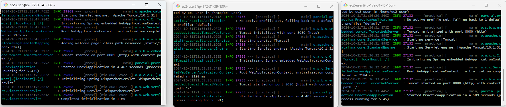
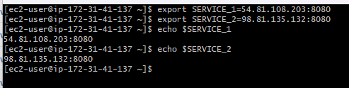
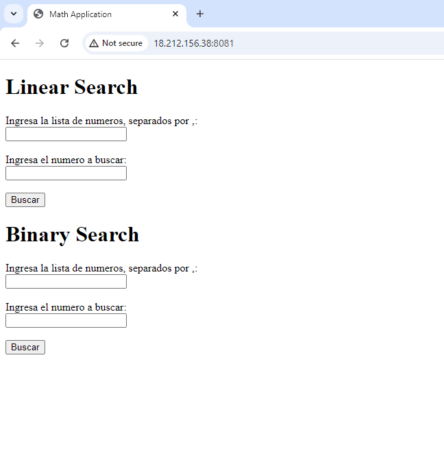
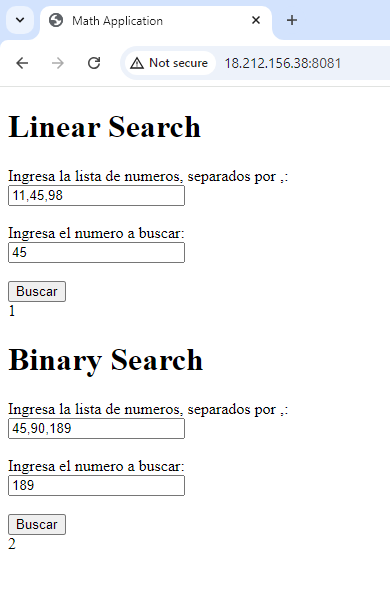
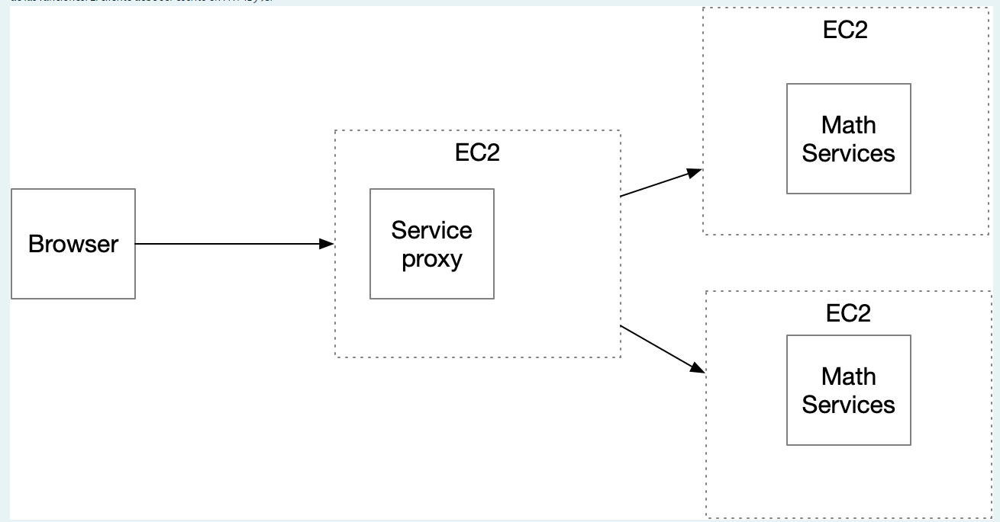

### PARCIAL 2 CORTE- AREP

Este proyecto consiste en un modelo de microservicios que tiene un servicio Math  ejecutar las funciones de busqueda lineal y binaria. 

Adicionalmente, se implementa un servicio de proxy que recibe las peticiones y las delega a las dos instancias del servicio math usando un algoritmo pseudo round-robin.


## Starting

En su computadora descargue o clone los siguientes repositorios.

[Repository Math Service](https://github.com/Sebasvasquezz/Parcial-2-Corte) 

[Repository Proxy Server](https://github.com/Sebasvasquezz/Proxi-parcial-C2) 


```
git clone https://github.com/Sebasvasquezz/Parcial-2-Corte

git clone https://github.com/Sebasvasquezz/Proxi-parcial-C2 
```

#### Correr el servidor de proxy 

1. Abra una terminal de la instancia del proxy.

2. Use el comando para generar el jar con el siguiente comando.
    ```
    mvn clean package
    ```

3. Corra la aplicación.

    ```
    java -jar /proxi-0.0.1-SNAPSHOT.jar

    ```
    Ahora el servidor proxy esta corriendo en el puerto 8081 


#### Correr el servidor Math
1. Luego se conecta a cada instancia de EC2 y en cada terminal ejecute los siguientes comandos.

    ```

        mvn clean package

        java -jar practica-0.0.1-SNAPSHOT.jar 
    ```

### Ejecucion en AWS
 * Desplegue 3 maquinas:
    - Una para el proxi
    - Una para cada servicio Math 

    
 * Configure las variables de entorno en el servidor proxi:
    
* Ejecucion:
    - Se accede a la direccion http://18.212.156.38:8081/
    

    - Se hacen pruebas:

        

  

## Arquitectura



Implementa un service proxy que recibe las solicitudes de llamado desde los clientes  y se las delega a las dos instancias del servicio de ordenamiento usando un algoritmo de round-robin. El proxy  esta desplegado en otra máquina EC2. 
Los servicio de matematicos, son linearSearch y binarySearch. Para la coneccion se uso HTTP , para el browser HTML y JS, en el servicio matematico se uso java con spring-boot.

### Falto por hacer:
No alcance a documentar el codigo, pero desarrolle y desplgue el parcial en su totalidad durante la clase, el readme lo termine despues, pero no hubo cambios en el codigo.

## Contruido con:

* [Maven](https://maven.apache.org/) - Dependency management
* [java](https://www.java.com/es/) - Programming language
* [Spring boot](https://start.spring.io/) - Framework

## Versionado

Se uso [Git](https://github.com/) para el manejo de versiones.

## Autor

* **Juan Sebastian Vasquez Vega** - [Sebasvasquezz](https://github.com/Sebasvasquezz)

## Fecha

10/31/2024